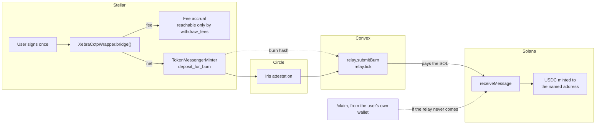

# Xebra


<sub>The 67-second film, looping. [Full quality, 1080p](film/xebra-film.mp4).</sub>

USDC from Stellar to Solana, over Circle's CCTP. One corridor, one asset, **mainnet only**.

A user connects a Stellar wallet, enters an amount and a Solana address, and signs once. A
Soroban wrapper contract takes the fee and hands the burn to Circle in the same transaction. A
relay watches for that burn, waits for Circle's attestation, and pays the SOL to mint on the far
side. If the relay never shows up, the transfer is still claimable by anyone — including the user,
from `/claim`.

The wrapper never holds a user's principal. Either the fee is taken and the burn happens in the
same transaction, or the whole transaction reverts and the user keeps every stroop.

## Status

| | |
|---|---|
| Wrapper contract | **Live on Stellar mainnet** — `CCNWLGFMILJU476RZHDA2PSUH2WH3LIPERHS6BYPCRVDDYYNNUIKZMTJ` ([`deployments/mainnet.json`](./deployments/mainnet.json)) |
| Corridor | **One real transfer has completed end to end** — 1.000001 USDC, Stellar burn → Solana mint |
| Relay | Every part unit-tested; **has never run against a live Convex deployment**. That first transfer's mint was submitted by hand from `scripts/cctp-mint-solana.mjs` |
| Frontend | Builds and runs locally; not deployed |
| CI | lint, typecheck, `vitest`, `cargo test` and `forge test` on every push |

What is left before someone who is not us can bridge — and which parts need an account, a key or a
decision rather than code — is [`docs/go-live.md`](./docs/go-live.md).

## How a transfer works



Two properties do the load-bearing work when anything goes wrong:

- **`destination_caller` is zero**, so every message is permissionlessly mintable. If this project
  disappears mid-transfer, the burned USDC is still claimable forever by whoever holds Circle's
  attestation. `/claim` is that path, in the browser, from the user's own wallet.
- **The user is `caller` on `deposit_for_burn`**, not the wrapper. USDC moves from the user
  directly to Circle, argument-bound by the user's own signature — a fully compromised admin
  cannot redirect anyone's burn, and `withdraw_fees` structurally cannot reach user money.

Both are explained in [`contracts/stellar-cctp-wrapper/README.md`](./contracts/stellar-cctp-wrapper/README.md).

## Repo layout

The corridor — everything on the deployment path:

```
apps/web/                    Next.js frontend (Vercel) and its server routes
  app/                         / bridge · /claim · /recover · /intent/[hash]
  app/api/                     relay handoff, attestation, Solana RPC, recipient, health
  convex/                      relay state + scheduler: submitBurn, tick, jobs, cursors
contracts/stellar-cctp-wrapper/  XebraCctpWrapper — fee-taking front door to CCTP V2 (41 tests)
packages/
  relay-core/                  the relay pipeline, with no opinion about how it is hosted
  cctp-solana/                 receiveMessage builder, keypair decoding, mint submission
  network-config/              pinned mainnet constants + a validator that refuses an incoherent mix
  cctp-client/                 Iris attestation client, shared by relay and solver
  observability/               OTel traces/metrics, wired in through apps/web's instrumentation.ts
scripts/
  deploy-cctp-wrapper.sh       gated deploy (interface check, tests, release build, typed confirm)
  check-cctp-interface.sh      our trait vs. the live mainnet Circle contract
  preflight-bridge.mjs         checks that must pass before any burn
  recover-stranded-mint.mjs    operator recovery for a burn that named a wallet, not a token account
  cctp-mint-solana.mjs         manual mint, used for the first live transfer
```

Not on the deployment path — the Arc↔Stellar intent/escrow corridor and the self-hosted container
stack. They stay in the repo, and build and test in CI, for anyone who wants to run the container
version; nothing Vercel or Convex serves depends on them being up:

```
apps/            api · solver · cctp-relay · arbiter-service · projector · indexer-{arc,stellar,solana}
packages/        intent-schema · router-core · chain-adapters · arbiter-signer · db · event-bus
contracts/       arc-evm (XebraEscrow.sol, 17 tests) · stellar-soroban (14 tests)
infra/terraform  ECS Fargate, RDS, ElastiCache, Redpanda, KMS
docker-compose.yml  anvil, Stellar quickstart, solana-test-validator, Postgres, Redis, Redpanda
```

One live thread between the two: `/intent/[hash]` still reads `apps/api`'s `intentStatus`
procedure, so that page needs the container stack even though the bridge does not.
`lib/open-intent.ts` and `lib/build-open-intent-params.ts` are escrow-rail leftovers no page
imports since the bridge screen was rebuilt around amount and destination alone.

## Getting started

```bash
pnpm install
cp .env.production.example .env.production   # public mainnet constants; never a secret
pnpm --filter @xebra/web dev
```

`pnpm dev` points the UI at real money. Browsing is safe — quotes are Soroban simulations and
nothing moves until a signature — but a signed transaction spends real USDC.

The relay needs a Convex deployment of your own to run against, and Convex bundles the workspace
packages from their `dist/`, so build them first:

```bash
pnpm --filter @xebra/web^... build
cd apps/web && npx convex dev
```

### Commands

| | |
|---|---|
| `pnpm lint` / `pnpm lint:fix` | Biome over the whole repo |
| `pnpm typecheck` | every workspace package |
| `pnpm test` | vitest, plus the Rust and Foundry suites |
| `pnpm test:contracts` | `cargo test` and `forge test` only |
| `pnpm check:env` | no secrets in env files, correct tracking, coherent config, client-bundle hygiene |
| `pnpm check:cctp` | our CCTP trait against the live mainnet Circle contract |
| `pnpm build` | `apps/web` writes to `.next-build`, so a build cannot wipe what `next dev` is serving |

`contracts/*/lib/` is git-ignored and holds no submodules, so Foundry dependencies are installed
per checkout — CI pins them itself. `convex/_generated/` is committed, which is what lets the repo
typecheck before anyone has run `npx convex dev`.

## Deployment

Two services, both with free tiers: **Vercel** serves the UI, **Convex** runs the relay and holds
its state. No AWS, no Docker, no Redis, no Kafka, no Postgres.

Convex is what makes a serverless relay honest: serializable mutations make
`upsertBySourceTx` — the idempotency that stops a burn being minted twice — a read and a write in
one transaction, and its cron runs every minute on the free plan where Vercel Cron on Hobby runs
once a day. Mechanics, environment variables and costs are in
[`docs/deploying.md`](./docs/deploying.md).

The hot wallet is the thing most likely to break this in production: it drains by design, and when
it empties every transfer stalls *silently*. Two free things watch it — a Convex cron that throws
when the balance is critical, and `GET /api/health` returning 503 for any uptime monitor.

## Tech stack

| Layer | Choice | Why |
|---|---|---|
| Monorepo | pnpm workspaces + Turborepo | task-graph caching across small TS packages and non-JS contract packages |
| Contract | Rust + `soroban-sdk` | native `require_auth`, no bespoke signature scheme |
| Frontend | Next.js App Router on Vercel | server routes host what the browser must not do itself |
| Wallet | Stellar Wallets Kit (Freighter) | Solana is destination-only — an address field, no connector |
| Relay state | Convex | serializable mutations and a one-minute cron on the free plan |
| Config | `@xebra/network-config` | one pinned mainnet preset, cross-validated; every address read from the live chain |
| Lint/format | Biome | single fast binary, replaces ESLint + Prettier |
| Tests | vitest · `cargo test` · `forge test` | one CI job per toolchain |

## Docs

| | |
|---|---|
| [`docs/go-live.md`](./docs/go-live.md) | What has to happen before launch, split by who can do it |
| [`docs/deploying.md`](./docs/deploying.md) | Vercel + Convex mechanics, costs, alerting, the relay's exposure |
| [`docs/environments.md`](./docs/environments.md) | Mainnet-only config, what is enforced, secrets handling |
| [`contracts/stellar-cctp-wrapper/README.md`](./contracts/stellar-cctp-wrapper/README.md) | Fee model, decimals, the no-custody invariant, residual risks |
| [`docs/architecture.md`](./docs/architecture.md) | The original two-rail v2 design. Written before the build; the Postgres/Kafka/ECS stack it describes is the self-host path, not what deploys |
| [`xebra-spec_051150 (1).md`](<./xebra-spec_051150 (1).md>) | Corridor 1 (Arc → Stellar), spec frozen |
